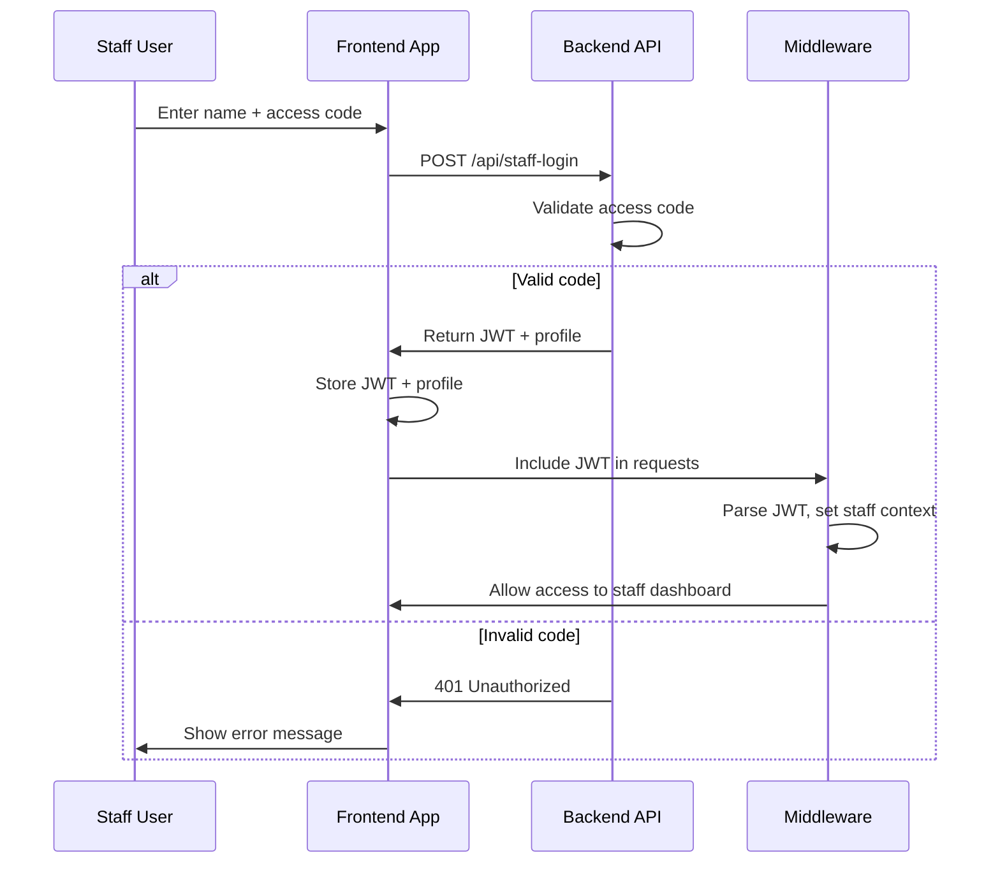

# Secure Staff Login System — Implementation Plan

---

## 1. Backend: Create `/api/staff-login` Endpoint

- Accepts `{ fullName, accessCode }`
- Validates `accessCode` against a secure backend store (DB or env secrets)
- If valid:
  - Generates a JWT token with staff info and role
  - Optionally creates/updates staff profile
  - Returns `{ token, staffProfile }`
- If invalid:
  - Returns 401 Unauthorized

---

## 2. Frontend: Update Staff Login

- On submit, POST to `/api/staff-login`
- On success:
  - Store JWT token in localStorage or cookie
  - Save staff profile info
  - Redirect to `/dashboard`
- On failure:
  - Show error message

---

## 3. Middleware

- Parse JWT from cookie or header
- If valid and `type: 'staff'`, allow access
- Otherwise, redirect or restrict

---

## 4. Role-Based Access

- Use JWT role to control UI, API access, and routing

---

## 5. Security

- Never hardcode access codes in frontend
- Sign JWTs securely
- Set token expiration
- Use HTTPS
- Invalidate tokens on logout

---

## 6. Optional Enhancements

- Add refresh tokens for longer sessions
- Allow staff registration via admin panel
- Log staff login attempts for audit
- Support multi-factor authentication for staff

---

## Mermaid Diagram: Staff Login Flow

---

## Summary

- Backend validates staff access codes and issues JWTs.
- Frontend uses this JWT for authentication.
- Middleware recognizes staff JWTs.
- Role-based access is enforced everywhere.
- Security best practices are followed.